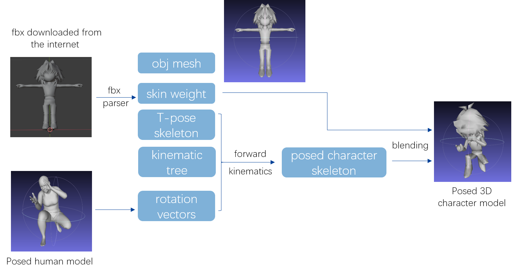
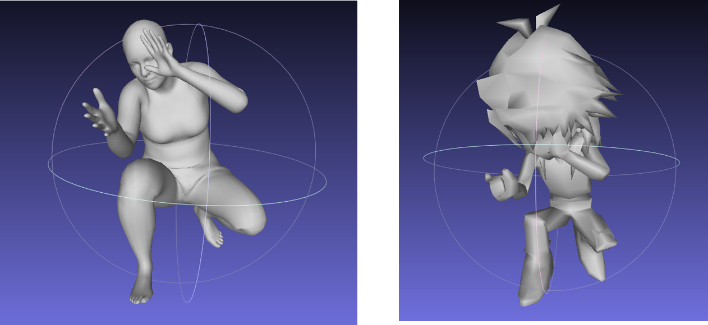
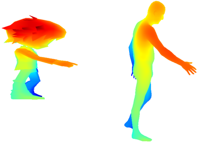

# Pose2Carton
A educational project (e.g., using 3D pose to control 3D carton) for learning 3D vision (application of human mesh recovery) or imitation learning

# Update Notes 
2021/05/17: Add quick start [instructions](doc/fbx_from_the_internet.md]) to help you dive into this project & Use custom obj loader instead of open3d

# Requirements
* code only tested on linux system (ubuntu 16.04)
* open3d==0.11.0(**if you want to try online models, use open3d 0.10.0 along with your own video recording tool to save visualization**)
* tqdm
* opencv-python

`pip install -r requirements.txt` (anaconda recommended, python3)

# Tutorials
* For maya download & install: [Tutorial1](https://blog.csdn.net/otter1010/article/details/111396928), [Tutorial2](https://knowledge.autodesk.com/zh-hans/support/maya/learn-explore/caas/simplecontent/content/installing-maya-2020-ubuntu.html) [Tutoria3](https://blog.csdn.net/White_Idiot/article/details/78253004)
* For SMPL, refer to [webpage](https://smpl.is.tue.mpg.de/) or popular implementation [Minimal-IK](https://github.com/CalciferZh/Minimal-IK)
* For online model matching, refer to [OnlineMatchTutorial](doc/fbx_from_the_internet.md)

# Code structure
* [`transfer.py`](transfer.py): the main mapping file
* [`vis.py`](vis.py): visualize the mapping sequence of the corresponding mesh
* [`pose_samples`](pose_samples/): some samples of SMPL model for one frame
* [`obj_seq_id`](obj_seq_id/): some samples of SMPL model for temporal sequence

# Method

# Project Result

# Visulization
Run vis.py (to get more clear visualization, press ctrl + 1 / ctrl + 2 / ctrl + 3 ...)

# LICENSE
The code is under Apache-2.0 License.

# For EE228 students from SJTU
Please read course project [requirements](doc/EE228.md). 
